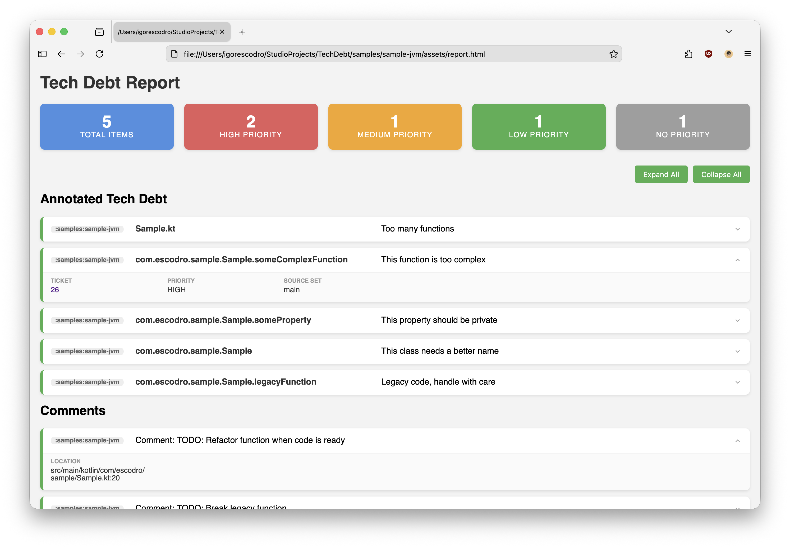

# 💸 TechDebt

[](https://github.com/igorescodro/tech-debt/actions/workflows/build.yml)

TechDebt is a Kotlin Symbol Processing (KSP) tool designed to help developers track and visualize technical debt
directly within their codebase. By using the `@TechDebt` annotation, you can document technical debt, link it to
tickets, and assign priority levels. The tool then generates a comprehensive HTML report summarizing all marked
technical debt.

## Goal

The primary goal of TechDebt is to make technical debt visible and manageable. Instead of letting TODOs get lost in the
code, TechDebt allows you to:
- Formally document technical debt at the file, class, function, or property level.
- Categorize debt by priority (Low, Medium, High).
- Link code smells or shortcuts to issue tracker tickets.
- Generate a visual report to share with the team or stakeholders.

## How it Works

TechDebt uses **KSP (Kotlin Symbol Processing)** to scan your source code for the `@TechDebt` annotation during the
compilation process. Each module generates its own local report, which is then collected and consolidated by the
**TechDebt Gradle Plugin** into a single, comprehensive HTML report.

## Report example



### 🧾 [Link to example](https://htmlpreview.github.io/?https://github.com/igorescodro/tech-debt/blob/main/samples/sample-jvm/assets/report.html)

## Quick Start

### 1. Apply the Gradle Plugin

In your `build.gradle.kts`:

#### Latest version: [](https://central.sonatype.com/search?q=g:io.github.igorescodro+techdebt)

```kotlin
plugins {
    id("io.github.igorescodro.techdebt") version "<latest-version>"
}
```

### 2. Annotate your code

Use the `@TechDebt` annotation to mark areas of technical debt:

```kotlin
@TechDebt(
    description = "Quick fix to handle edge case, needs proper refactoring.",
    ticket = "JIRA-123",
    priority = Priority.HIGH
)
fun complexMethod() {
    // ...
}
```

The annotation can be applied to:
- Files
- Classes
- Functions
- Properties

### 3. Generate the report

The report is generated by the `generateTechDebtReport` task. Simply run:

```bash
./gradlew generateTechDebtReport
```

The consolidated HTML report will be generated in the root build directory:
`build/reports/techdebt/consolidated-report.html`

## Configuration (Optional)

You can customize the output file path in your root `build.gradle.kts`:

```kotlin
techDebtReport {
    outputFile.set(layout.buildDirectory.file("custom/path/report.html"))
}
```

## Features

- **Consolidated HTML Report**: A clean, easy-to-read summary of all technical debt from all modules in your project.
- **Priority Levels**: Support for `LOW`, `MEDIUM`, and `HIGH` priority levels (and `NONE`).
- **Ticket Linking**: Keep track of related tickets in your issue tracking system.
- **Multi-module Support**: Automatically collects data from all subprojects.

## License

```
Copyright 2026 Igor Escodro

Licensed under the Apache License, Version 2.0 (the "License");
you may not use this file except in compliance with the License.
You may obtain a copy of the License at

    http://www.apache.org/licenses/LICENSE-2.0

Unless required by applicable law or agreed to in writing, software
distributed under the License is distributed on an "AS IS" BASIS,
WITHOUT WARRANTIES OR CONDITIONS OF ANY KIND, either express or implied.
See the License for the specific language governing permissions and
limitations under the License.
```
